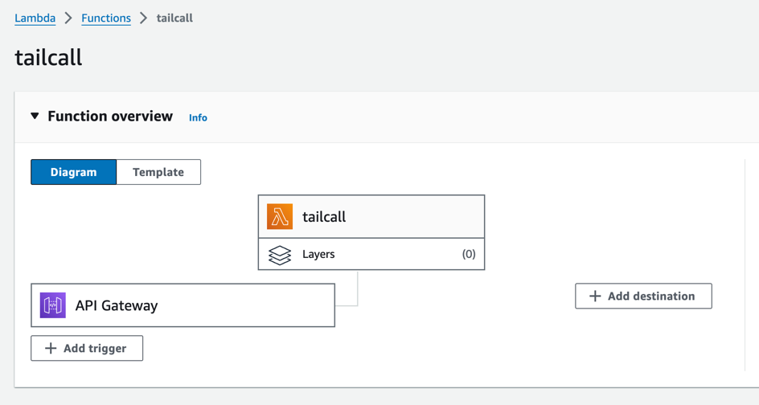

# gh-action

A GitHub Action for deploying a [tailcall](https://tailcall.run) server on AWS Lambda, using terraform.

### Inputs

| Name                       | Type       | Description                                                                                                                    |
|----------------------------|------------|--------------------------------------------------------------------------------------------------------------------------------|
| `tailcall-config`          | `Required` | The path to the `tailcall` configuration file used for deployment. This file defines the server's setup and behavior.            |
| `tailcall-version`         | `Optional` | Specifies the version of `tailcall` to use for deployment. If not provided, the Action defaults to the latest available version. |
| `aws-access-key-id`        | `Required` | The AWS access key ID required for authentication. Ensure this value is stored securely, such as in GitHub Secrets.            |
| `aws-secret-access-key`    | `Required` | The AWS secret access key required for authentication. Store this securely, such as in GitHub Secrets.                         |
| `aws-region`               | `Required` | The AWS region where the Lambda function will be deployed (e.g., `us-east-1`).                                                   |
| `aws-iam-role`             | `Optional` | The IAM role name to be created and used for the deployment. If not specified, defaults to `iam_for_tailcall`.                   |
| `aws-lambda-function-name` | `Optional` | The name assigned to the created Lambda function. Defaults to tailcall if not specified.                                       |

## Example

```yaml
on: [push]

jobs:
  deploy_tailcall:
    runs-on: ubuntu-latest
    name: Deploy Tailcall
    steps:
      - name: Checkout repository
        uses: actions/checkout@v4
      - name: Deploy Tailcall
        id: deploy-tailcall
        uses: tailcallhq/gh-action@v0.2
        with:
          aws-access-key-id: ${{ secrets.AWS_ACCESS_KEY_ID }}
          aws-secret-access-key: ${{ secrets.AWS_SECRET_ACCESS_KEY }}
          aws-region: 'us-east-1'
          aws-iam-role: 'iam_for_tailcall'
          tailcall-config: 'config.graphql'
```

> **Note**: The AWS account associated with the `AWS_ACCESS_KEY_ID` and the `AWS_SECRET_ACCESS_KEY` must have the necessary permissions to create an IAM role.

### Deployment Steps Overview

The deployment process involves several key actions that are handled by Terraform, ensuring a seamless setup of your Tailcall server on AWS Lambda. Here's a detailed breakdown of the important steps:



### API Gateway Configuration

The configuration of the API Gateway involves multiple resources that together route HTTP requests to the deployed Lambda function:

- **Create REST API**: An API Gateway REST API named tailcall is created.
- **Create {proxy+} Resource**: This resource captures all requests to any endpoint, acting as a catch-all proxy.
- **Create Proxy Method**: An ANY method is defined for the {proxy+} resource, meaning it will handle all HTTP methods without requiring authentication or an API key.
- **Create Proxy Integration**: An AWS_PROXY integration is set up for the {proxy+} method, routing requests directly to the Lambda function.
- **Create Root Method**: Defines an ANY method for the root resource of the API, handling all HTTP methods without requiring authentication or an API key.
- **Create Root Integration**: Sets up an AWS_PROXY integration for the root method, routing requests directly to the Lambda function.
- **Deploy API Gateway**: Deploys the API Gateway configuration. The deployment depends on both the {proxy+} and root integrations being in place.
- **Create Stage**: Creates a stage named live for the deployed API, which allows it to be invoked.
- **Configure Method Settings**: Configures method settings for all methods in the live stage, though no specific settings are provided in this configuration.

### Lambda Permissions for API Gateway

Ensuring that API Gateway has the necessary permissions to invoke the Lambda function is crucial:

- **Grant Invoke Permissions**: Grants API Gateway permission to invoke the Lambda function. The source_arn specifies that the permission applies to any method on any resource within the API Gateway REST API.

### Output the API Gateway URL

Finally, the output provides the URL of the deployed API Gateway, which can be used to access the GraphQL endpoint:

- **Output GraphQL URL**: Provides the URL to the GraphQL endpoint of the deployed Tailcall server, accessible via the live stage of the API Gateway.